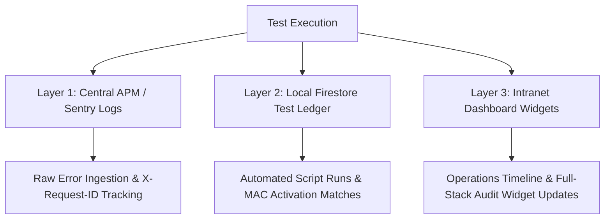

# Learning & Development: Internal Testing & Agentic Onboarding Playbook

This playbook outlines the protocols for our internal sandbox testing phase. It defines how test results are tabulated, how errors are logged and escalated, how role-specific checkmarks are assigned to job codes, how users interact with their agentic co-pilots, and how we assign those agents.

---

## 1. How Internal Testing Results Are Tabulated

Testing results are tracked and aggregated across three distinct layers, providing real-time auditability:



1.  **Centralized APM (Application Performance Monitoring) Logging:** Every transaction, API call, geocoding request, and claims state evaluation is tagged with a unique request header (`X-Request-ID`). If a test fails or encounters a timeout, Sentry routes a structured JSON log directly to our monitoring stack.
2.  **Firestore Test Ledger (`/test_runs`):** A test coordinator script records automated test runs, capturing inputs, expected outputs, execution speeds, and pass/fail statuses.
3.  **Visual Intranet Widgets (Consolidated View):**
    *   **[intranet_audit_widget.html](file:///C:/Users/greg_/OneDrive/Documents/Antigravity%20Save%20Folder/Chainmail-Intranet-Widgets/intranet_audit_widget.html)**: Displays the high-level health (0–100%) of all 13 full-stack architectural layers.
    *   **[intranet_operations_timeline.html](file:///C:/Users/greg_/OneDrive/Documents/Antigravity%20Save%20Folder/Chainmail-Intranet-Widgets/intranet_operations_timeline.html)**: Displays a date-stamped log showing the specific ticket or test-case ID, description, and status (`DONE`, `TO DO`, `QUEUED`, `PENDING_DVN`).

---

## 2. What Happens When the System Hits an Error

To preserve capital and protect the network from incorrect state changes, we enforce **strict fail-safe protocols**:

1.  **Immediate Hard-Halt and State Exceptions:**
    *   *Geospatial Coordinate Drift:* If coordinates returned by geocoding API drift beyond the 0.0001-degree threshold from static imagery baselines, the system halts processing and raises a `GeospatialDriftException`.
    *   *Confidence Intervals:* If multi-factor confidence calculations (evaluating local permits, municipality maps, and historical satellite tracks) drop below **95%**, the automated underwriting engine halts, pausing active premium quotes.
2.  **The Adverse Non-Automation Rule (Human-in-the-Loop Handoff):**
    *   Under Florida OIR and New York DFS Part 500 regulations, **Agentic AI is strictly prohibited from executing autonomous adverse claims actions (denials or cancellations) without licensed human oversight.**
    *   When an validation error or threshold breach occurs, the Agent cannot deny the file. Instead, the backend halts automated processing, marks the document status as `PENDING_ARBITRATION`, and pushes a alert panel containing raw JSON payloads directly to the human Integrity Officer's console.
3.  **Backup Data Routing:** If a physical weather station (IoT gateway) goes offline or suffers telemetry packet loss, the Ingestion Agent registers a disconnect, switches to backup government weather feeds (NOAA/NWS) to check regional parametric bounds, and logs a recovery notice.

---

## 3. Job Code Testing Matrix

To maximize test coverage, coworkers will evaluate the platform features corresponding to their operational domains and job descriptions:

### A. Executive Level (CEO / Strategic Oversight)
*   **Target Domain:** Domain 4 (Treasury & Cryptographic Governance).
*   **Testing Focus:**
    *   Verify the 3-of-5 multi-signature threshold sequence for capital reserve tranches.
    *   Verify Bitcoin treasury hedging triggers and check the USD-denominated digital reserve asset conversion ledgers.
    *   Review high-level Intranet budget burn widgets for accuracy.

### B. Operations & Product Management (COO / PMs)
*   **Target Domain:** Domain 1 (Operational Lifecycle) and Domain 5 (IoT Ingestion).
*   **Testing Focus:**
    *   Simulate Shopify kit checkouts to verify the automated `/api/onboarding/provision` webhook post routes.
    *   Test device MAC address pre-provisioning bindings in the Firestore sensors collections.
    *   Trigger high-frequency simulated telemetry inputs to verify "verified node" transitions.

### C. Legal, Risk & Compliance (CRO / Regulatory Officers)
*   **Target Domain:** Domain 6 (Regulatory Compliance & Zero-Knowledge Privacy).
*   **Testing Focus:**
    *   Verify Zero-Knowledge proving outputs ($\pi$) to ensure no personally identifiable information (PII) or raw geocoded coordinates leak on public ledgers.
    *   Test state compliance automated reports (e.g., FL OIR-B1-2222 metrics for timing constraints).
    *   Audit the human-override adjuster panel to confirm the Adverse Non-Automation rule holds.

### D. Underwriting & Actuarial (Lead Actuaries / Underwriters)
*   **Target Domain:** Domain 2 (The Quant Brain & Parametric Pricing).
*   **Testing Focus:**
    *   Inject extreme coordinate drift inputs to confirm geocoding halt rules trigger.
    *   Verify underwriting risk pricing results across different hurricane zones.
    *   Stress-test confidence interval thresholds.

---

## 4. Agent Assignments & Interaction Mechanics

Every role within the Chainmail ecosystem is assigned an **Agentic Co-Pilot**. Users interact with their agents through unified intranet components.

```
+-----------------------------------------------------------------------+
|  INTRANET WIDGET LAYOUT                                               |
|                                                                       |
|  [ Operations Timeline ]       [ Floating AI Knowledge Companion ]    |
|  * OPS-250 (To Do)             +-----------------------------------+  |
|  * OPS-257 (Done)              | Connected: Underwriting_Agent_01  |  |
|                                |                                   |  |
|  [ Role Doctrine: Actuary ]    | User: "Check risk at 12665 Oaks"  |  |
|  Access: Read/Write Models     | Agent: "Geocoding coordinates..." |  |
|                                |                                   |  |
|  [ Sidecar Action Panel ]      | [ Send prompt ] [ Edit system ]   |  |
|  * Approve Underwriting Quote  +-----------------------------------+  |
+-----------------------------------------------------------------------+
```

### How We Assign Agents
1.  **Authentication Mapping (ABAC):** When a user logs in via Google OAuth, the system inspects their authenticated email against the `/users/{uid}` database registry. 
2.  **Role Provisioning:** Firestore assigns the user a corresponding role claiming tag. 
3.  **Agent Binding:** Based on the claiming tag, the user is paired with a specific backend Agent model:
    *   `Manager, AI Implementation` $\longrightarrow$ `Antigravity (Core Agent)`
    *   `Lead Actuary AI` $\longrightarrow$ `Chief Underwriting Agent`
    *   `Integrity Officer / adjuster` $\longrightarrow$ `Claims Verification & Ingestion Agent`

### How Users Interact with Their Agents
*   **Intranet Floating AI Chat Widget:** A persistent, gold-accented chat window is embedded in the Intranet workspace. The user chats directly with their assigned agentic helper, allowing them to query database logs, audit codebases, or run tasks.
*   **Action Sidecars:** Inside the main dashboard, the Agent populates a sidecar pane with action cards (e.g., "Draft Claims Invoice Ready for Approval"). The human clicks "Approve/Reject" to complete the execution block.
*   **Doctrine Access:** The [Operational Guidelines Widget](file:///C:/Users/greg_/OneDrive/Documents/Antigravity%20Save%20Folder/Chainmail-Intranet-Widgets/intranet_roles_widget.html) links each role directly to their corresponding operational manuals and prompt structures, ensuring complete alignment.

---

## 5. Phased Sandbox Rollout Proposal

If you are not comfortable opening the system to all users immediately, we recommend a **Phased Sandbox Testing Framework** to isolate variables and maintain complete control:

```
[ Phase A: Greg Single-User ] ---> [ Phase B: Co-Founder Audit ] ---> [ Phase C: Department Sandbox ] ---> [ Phase D: Full Team Launch ]
```

*   **Phase A: Single-User Validation (Greg Only) — *Current***
    *   Only Greg's credentials have access rules in Firestore. No other users can log in or view databases. All live geocoding tests are run directly by Greg.
*   **Phase B: Co-Founder Audit (2 Users)**
    *   Assign access specifically to your co-founder. Together, run sandbox transactions (simulated Shopify checkout, simulated claims trigger) to verify payments and multi-signature payouts.
*   **Phase C: Phased Department Sandboxes (5 Users)**
    *   Enable access for the Lead Actuary and CRO. Restrict database access to a dedicated `/sandbox` collection. Allow them to test underwritings and regulatory audits without write access to production database folders.
*   **Phase D: Full Team Launch**
    *   Promote verified roles to standard production scopes, activate Google OAuth global logins, and monitor system integrations.
